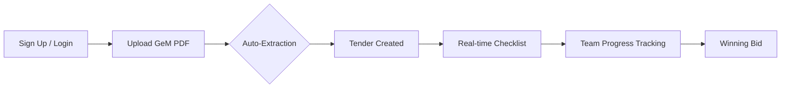

# GEMtracker v2.0 - Professional Project Documentation

## Executive Summary

**GEMtracker** is a cloud-native, enterprise-ready web application designed to streamline and automate the management of government tender bids from GeM (Government e-Marketplace). It eliminates the manual drudgery of tracking bid deadlines, organizing compliance documents, and coordinating team efforts through a centralized, real-time dashboard.

---

## Core Features 🚀

### 1. Automated PDF Extraction & Analytics 📄
The application uses advanced parsing to extract critical "DNA" from GeM tender PDFs instantly:
- **Bid Identification**: Bid Number (e.g., GEM/2026/B/7132339)
- **Deadline Management**: Automatic extraction of Bid End Date.
- **Metadata Tagging**: Item Category and Item Subject extraction.
- **A.I. Summarization**: 10-word summary for quick scanning.

### 2. Real-Time Multi-User Dashboard 📊
A mission-control interface built for speed and collaboration:
- **Live Sync**: Tenders and checklist updates appear instantly across all team screens.
- **Visual Countdown**: Real-time "Time Remaining" badges (Green = Safe, Red = Expired).
- **Responsive Sidebar**: Categorized view of active vs. expired tenders.
- **Company Isolation**: Secure data barriers ensure each company only sees their own team's bids.

### 3. 28-Point Compliance Command Center ✅
Every tender automatically initializes a professional compliance checklist:
- **Dual Tracking**: Separate "Ready" (prepared) and "Submitted" (uploaded to GeM) statuses.
- **Standardized List**: Pre-configured for EMD, PAN, GST, Manufacturer Authorization, Audit Statements, and 23+ more.
- **Progress Bars**: Visual representation of tender readiness.

### 4. Advanced Data & Document Management 💾
- **Secure Authentication**: High-level security via Supabase (JWT Tokens).
- **Centralized Templates**: A library of standardized formats (GST, PAN, Authorizations) for one-click download.
- **Original PDF Retrieval**: Access original tender documents anytime from anywhere.
- **Nickname System**: Custom labels for quick project identification.

---

## Technical Architecture 🏗️

### Frontend (User Interface)
- **Framework**: Next.js 16 (Vercel-optimized)
- **State Management**: React Hooks & Real-time Subscriptions.
- **Styling**: Vanilla CSS & Tailwind (Custom High-Contrast Theme).
- **Platform**: Hosted on **Vercel** for 99.9% uptime.

### Backend (Process Engine)
- **Framework**: FastAPI (Python 3.12)
- **Engine**: Render Web Service.
- **PDF Extraction**: pdfplumber with proprietary extraction logic.
- **Storage**: Supabase Storage Buckets for document persistence.

### Database (Brain)
- **Platform**: **Supabase (PostgreSQL)**.
- **Security**: Row Level Security (RLS) ensures data privacy.
- **Real-Time**: Postgres CDC for instant UI updates.

---

## User Workflow 🛠️



---

## Project Structure (v2.0)

```
GEMtracker/
├── backend/                # Render App
│   ├── app/                # FastAPI Core
│   │   ├── main_supabase.py # API & Auth logic
│   │   └── utils.py        # PDF Engine
│   └── Procfile            # Deployment Instructions
├── frontend/               # Vercel App
│   ├── src/
│   │   ├── app/            # Next.js App Router
│   │   ├── components/     # UI Components
│   │   └── lib/            # Supabase Connectors
│   └── next.config.ts      # Cloud Config
└── supabase/               # Infrastructure
    └── schema.sql          # DB Architect
```

---

## Key Advantages 🏁

✅ **Zero Entry**: No more manual typing from PDF to Excel.  
✅ **Team Sync**: No more "did we submit the GST copy?"—check it live.  
✅ **Global Access**: Access your tender dashboard from any device, anywhere.  
✅ **Deadline Security**: Color-coded alerts ensure you never miss a submission window.  
✅ **Compliance First**: 28 points of verification built into every workflow.

---

## Technology Stack

**Frontend:** Next.js, React, TypeScript, Tailwind, Axios
**Backend:** Python, FastAPI, pdfplumber, Supabase-Py
**Database:** PostgreSQL (Cloud), Supabase Auth

---

## Conclusion

GEMtracker v2.0 is a professional-grade solution that transforms GeM tender management from a chaotic manual process into a streamlined, automated, and collaborative workflow. By leveraging modern cloud technology and real-time data synchronization, it empowers businesses to focus on winning bids rather than managing paperwork.

---

**Live URL:** [ge-mtracker.vercel.app](https://ge-mtracker.vercel.app)  
**Backend:** Render (FastAPI)  
**Infrastructure:** Supabase  
**License:** Enterprise / Open Source
